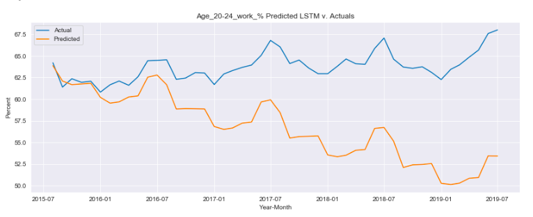
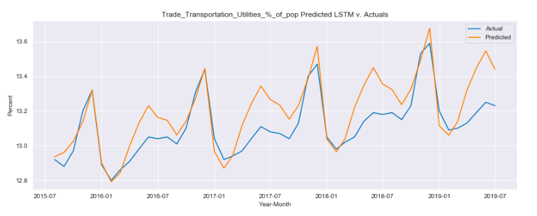

# Employment Prediction Using an LSTM Neural Network

According to our current administration, the US employment market is booming by all accounts. Unemployment levels are the lowest they've ever been (riding around 4% at the writing of this) and various industries are being touted as "saved" by the work of the current administration. The problem is, the metrics we see reported don't tell the whole story.

The metric most reported on is the U3 unemployment metric, which gives a particular picture of the employment market in the US, but doesn't give us a real picture of the health of the American work force. This metric has a few significant downsides. 

1. It doesn't take into account full-time vs. part-time workers. According to the U3 metric, if a person works just 1 hour a week, they are considered "employed" in the eyes of the unemployement rate. One would be hard pressed to find someone who thought that one hour of work a week, or even 20 hours of work a week, would constitute being employed.

2. It only looks at those who are actively seeking employment. This doesn't take into account the huge percentage of the population who has voluntarily left the workforce, and are not actively seeking employment. Those who would like to be working, but see the current system as one that doesn't have use for their skill set are known as disadvantaged workers, and the U3 metric has no consideration for this population.

3. It doesn't look at the percentage of our population on disability. Disability claims have skyrocketed over the last few decades. While there could be a number of reasons for this, but in the end what our government most cares about are the taxes it's able to withdraw from the working population, and this particular set of people are unable to contribute towards that endeavor.

The goal of this project is to create a new employment metric, one that our government can get behind (focused on tax contribution of the working population) and use two different types of predictive modeling (a typical SARIMA model and a newer tech Long Short Term Memory neural network) to find the best algorithm for predicting what employment in America will look like in the coming years. The goal is to look at not just employment predictions for the overall market, but to see what employment will look like across various industries and across various age groups.

Data was collected largely from the Federal Reserve Bank of St. Louis (https://fred.stlouisfed.org/) and the US Census Bureau (https://www.census.gov/data.html) through .csv and other file types. The libraries primarily used in this project are Pandas for EDA, the SARIMA modeling libary of statsmodels, and Keras for the implementation of a neural network.

My first goal is to look at the levels of US employment across the major industries in the US, namely Agriculture, Construction, Education and Health (defined as a single category by the US Census), Finance, Leisure and Hospitality, Manufacturing, Professional (which defines many white collar jobs, including jobs in tech), Retail, and Trade/Transportation/Utilities (also defined as a single category according to the US Census).

Next I focus on the levels of employment for various age groups in the population. My eventual goal is to see what percentage of each age group is actually in the workforce.

It's also important to look at the distribution of work as it relates to full time and part time work.

And the growth of the working population on disability

And bringing all this together, we develop our new employment metric, which you can see here against the current U3 metric reported by the US government.

*Employment metric*

*U3 metric*

We first use a typical SARIMA system to create a predictive model for where employment will be going in the next 4 years. The results can be seen below, with a RMSE of .89 percentage points across the 4 year prediction.

*Sarima model prediction against actual*

With the advent of neural networks, I wanted to try and create something better than the typical SARIMA model, so I implemented an encoder-decoder version of an LSTM neural network, looking to predict the employment in America to a greater degree than a model  based on trend and seasonality. My hypothesis is that the LSTM network will be able to pick up on interactions between the various metrics that the SARIMA model can't recreate, and the LSTM model has the added benefit of being able to predict the movement of all the industries and age groups (and their contribution towards the tax dollars of the workforce) within one model.

*LSTM new employment*

*LSTM other metrics*

While the LSTM network was not able to predict the employment metric as well as the SARIMA model, its other insights across industries and age groups could prove useful in the coming years.

Future plans for this project include:

- Incorporation of more data, specifically on the population of full time with one job vs. full time plus a part time job vs. all part time work making up the work week

- Continued tuning of the LSTM model to reach more accurate predictions